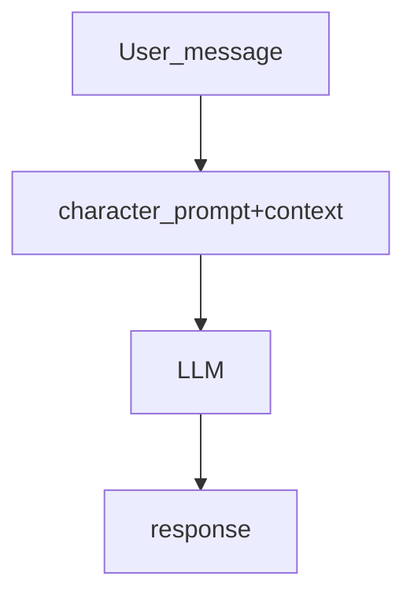
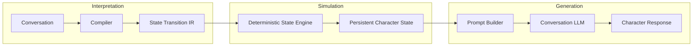
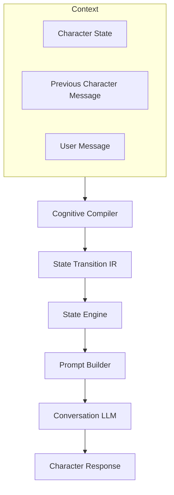
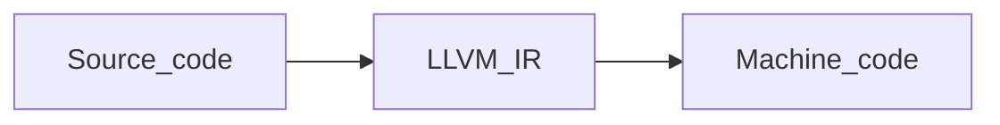
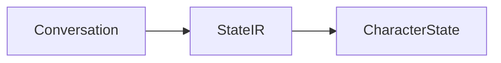
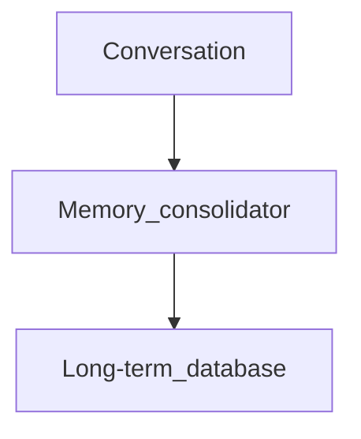
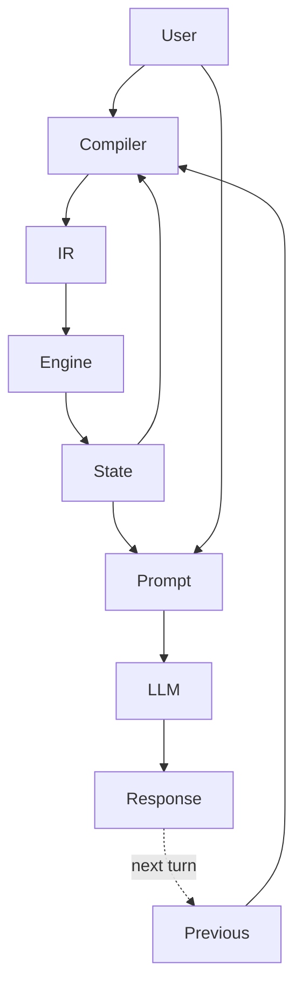

# CogStateIR - Cognitive State Intermediate Representation for AI Characters

## Overview

Current LLM-based character systems mostly rely on a simple architecture:



This approach has a major limitation: the LLM is responsible for everything at once:

* personality simulation;
* memory;
* emotional state;
* relationship evolution;
* reasoning;
* dialogue generation.

As a result, different characters often converge toward similar behaviors because the underlying model has strong default conversational patterns.

The goal of CogStateIR is not to reproduce human cognition itself, but to reproduce the **observable properties that make a character feel like a persistent individual**:

* continuity over time;
* stable personality;
* evolving relationships;
* consistent reactions;
* memory-driven behavior;
* self-consistent dialogue.

---

# Warning

`CogStateIR` is experimental, not efficient and not intended for production.

---

# Quickstart

First, clone the repo. Then, run :

```bash
cargo install --path .
```

All commands are invoked via `cogstate-ir <command>` (or `cargo run -- <command>` during development).

## Dataset

Create examples as numbered directories under `data/`, each containing an `input.yaml` and `output.yaml`:

```text
data/
  ├── example_01/
  │   ├── input.yaml
  │   └── output.yaml
  ├── example_02/
  │   ├── input.yaml
  │   └── output.yaml
  └── ...
```

Use the `new_examples` script to quickly create empty example directories:

```bash
./new_examples 10   # creates example_57 … example_66 (after existing ones)
```

For the dataset schema and annotation guidelines, see `DATASET_CREATION_GUIDE.md`.

For training results and model evaluation, see `TRAINING_RESULTS.md`.

For the implementation roadmap, see `PLAN.md`.


## Validation

Validate all examples:

```bash
cogstate-ir validate-all data/
```

Validate a single pair:

```bash
cogstate-ir validate data/example_01/input.yaml data/example_01/output.yaml
```

## Training

Train from scratch (downloads HuggingFace model, fine-tunes on your dataset):

```bash
cogstate-ir train --dataset data/ --epochs 100
```

Save checkpoints every N epochs to monitor progress:

```bash
cogstate-ir train --dataset data/ --epochs 100 --checkpoint-every 10
```

Resume from a previous checkpoint (downloads config.json only, loads your weights):

```bash
cogstate-ir train --resume model-epoch10.safetensors --epochs 50
```

Customize the learning rate and model:

```bash
cogstate-ir train --dataset data/ --lr 0.0001 --model-id HuggingFaceTB/SmolLM2-360M-Instruct
```

You can find all the models [here](https://huggingface.co/CogStateIR).

### Current training status

The first training run used **SupraLabs/Supra-50M-Instruct** (50M params) with **11 examples** for **230 epochs** (≈3 hours on CPU), reaching a loss of **0.205734**. See `TRAINING_RESULTS.md` for detailed results, predicted outputs, and next steps (larger dataset, larger model, LoRA).

### Checkpoint naming

With `--output model.safetensors` (default) and `--checkpoint-every 10`:

```
model-epoch10.safetensors
model-epoch20.safetensors
...
model-epoch100.safetensors
```

### Resume details

- Only `config.json` (~1 KB) is downloaded from HuggingFace — the large `model.safetensors` is skipped.
- Optimizer (AdamW) momentum is not persisted, so expect a brief loss spike on resume.
- After resuming, the model is trained for the specified number of additional epochs.

## Prediction

Run the trained compiler on an input:

```bash
cogstate-ir predict --weights model.safetensors data/example_01/input.yaml
```

## State utilities

Create a character state with given personality traits:

```bash
cogstate-ir init proud distrustful curious
```

Apply state-change operations from a YAML file:

```bash
cogstate-ir apply state.json ops.yaml -o updated_state.json
```

---

# Core Idea

Separate the character's internal evolution from language generation.

The LLM should not be the character, it should be the voice of a character whose internal state is maintained externally.

Only the Generation stage uses a large language model. Interpretation is delegated to a small specialized model, while Simulation remains fully deterministic, based on the interpretation and the current state.




---

# Cognitive State Compiler

The Cognitive State Compiler is a small model responsible for interpreting interactions.

It does not generate dialogue.

Its task is:

> Given the current character state, the user's message, and the character's previous expression, determine how the internal state should evolve.

Mathematically:

```
f(
    current_state,
    user_message,
    previous_character_message
)
    ->
    delta_state
```

Not:

```
f(message) -> response
```



---

# Why Include the Previous Character Message?

A character is not only affected by what others say.

A character is also affected by what it has **done and expressed previously**.

The previous message is an action performed by the character.

Example:

Current state:

```yaml
personality:
  proud: high
  distrustful: high

relationship:
  user:
    trust: medium
```

User:

```
"I'm sorry for lying to you."
```

Previous character message:

```
"I don't care about your excuses. People like you always betray others."
```

The compiler should understand that the character has already:

* expressed hostility;
* created emotional distance;
* reinforced a defensive posture.

Output:

```yaml
operations:

- relationship.defensiveness++

- emotion.anger.stabilize

- memory.reinforce(
    previous_conflict
)

- reflection.start(
    "possible_overreaction"
)
```

Without the previous character message, the system only sees the user's apology.

With it, the system sees a conversation between two evolving agents.

---

# Internal State vs Expressed State

A character can feel one thing and express another.

Example:

```yaml
internal_state:

emotion:
  anger: high

beliefs:
  user_is_unfair: true


expressed_state:

tone:
  calm

strategy:
  avoid_conflict
```

The internal state represents the character.

The expressed state represents the behavior shown to others.

The previous character message is the bridge between both.

It allows the system to understand:

* what the character felt;
* what the character chose to show;
* what consequences this expression created.

---

# Character Speech as a Cognitive Event

A spoken sentence is not only output.

It can create new internal constraints.

Example:

Character says:

```
"I will never forgive you."
```

This creates a conversational commitment:

```yaml
commitments:

- id: statement_42

  type:
    emotional_claim

  content:
    "I will never forgive you"

  strength:
    medium
```

Later:

User:

```
"But you helped me yesterday."
```

The compiler can detect tension:

```yaml
operations:

- commitment.review(statement_42)

- self_consistency.pressure++

- belief.update(
    "I never forgive people"
)

- reflection.start
```

This allows characters to evolve through their own actions, not only through external events.

---

# Why Use State Transitions Instead of Absolute Values?

Avoid:

```yaml
trust: 0.73
anger: 0.24
```

because numerical values are difficult to annotate and interpret.

Prefer:

```yaml
trust:
  increases

anger:
  decreases

uncertainty:
  increases
```

The actual numerical interpretation belongs to the state engine.

Example:

```rust
trust.increase(SMALL);
```

could internally become:

```
+0.02
```

or:

```
relationship_factor * event_weight
```

without retraining the model.

---

# Cognitive Intermediate Representation (Cognitive IR)

The compiler outputs a small set of primitive operations.

Example:

```yaml
operations:

- relationship.trust++

- emotion.anger--

- memory.reinforce(event_42)

- attention.focus(user)

- reflection.start

- commitment.review(statement_12)
```

The Cognitive IR acts like an intermediate representation in a compiler.

Similar concept:



CogStateIR:



---

# Character State Engine

The persistent identity exists outside the LLM.

Example:

```
character/

├── core/
│   ├── identity
│   ├── personality
│   └── values
│
├── cognition/
│   ├── beliefs
│   ├── goals
│   ├── attention
│   ├── self_model
│   └── commitments
│
├── memory/
│   ├── episodic
│   ├── semantic
│   ├── procedural
│   └── memory_index
│
├── social/
│   └── relationships
│
├── affect/
│   ├── emotions
│   └── moods
│
├── behavior/
│   ├── habits
│   └── expression_style
│
└── history/
    └── state_transitions
```

The database is the persistent identity.

---

# Dataset Creation

The main challenge is not model training.

It is creating the right dataset.

The dataset should teach interpretation, not writing. Avoid literary scenes, complete roleplay conversations, and generated stories, as they introduce stylistic bias.

Use small interaction fragments.

Example:

```
Character information:

- personality:
    distrustful
    proud

- relationship:
    user trust = medium

- current state:
    anger = high


Previous character message:

"I don't believe your excuses."


User:

"You are right, I should have told you earlier."
```

Target:

```yaml
operations:

- emotion.anger.decrease

- relationship.trust.increase

- memory.reinforce(
    honesty_issue
)

- reflection.start

- expression:
    maintain_defensive_tone
```

---

# Annotation Principles

Do not annotate:

* exact emotions;
* exact numerical values;
* hidden chain-of-thought;
* complete internal monologues.

Annotate:

* direction of change;
* affected systems;
* important events;
* behavioral consequences.

Examples:

```
trust increases slightly

anger decreases

old memory activated

relationship becomes uncertain

character becomes defensive

previous statement requires reconsideration
```

---

# Possible Model Architecture

## Cognitive State Compiler

Size:

```
2B-4B parameters
```

Role:

* interpret interactions;
* detect conflicts;
* update internal state;
* produce Cognitive IR.

No dialogue generation.

---

## Conversation Model

Size:

```
8B-14B+
```

Role:

Generate natural language from:

* current character state;
* relevant memories;
* cognitive operations;
* personality constraints;
* communication style.

Input:

```
character_state
+
cognitive_ir
+
conversation_context
```

Output:

```
character_message
```

---

## Memory Consolidator

Optional asynchronous model:



Responsibilities:

* merge memories;
* remove irrelevant information;
* reinforce important events;
* update relationships;
* detect recurring patterns.

---

# Full Cognitive Loop

The complete architecture becomes:



The character learns not only from what happens to it.

It also learns from what it chooses to do.

---

# Tooling

This repository provides a Rust CLI. Run `cogstate-ir --help` for all commands.

| Command | Description |
|---|---|
| `validate` | Validate a single example pair |
| `validate-all` | Validate all pairs under a directory |
| `init` | Create a character state with given personality traits |
| `apply` | Apply YAML operations to a character state |
| `train` | Fine-tune the compiler model on your dataset |
| `predict` | Run the trained compiler on an input |

See the Quickstart section above for examples of each.

---

# Key Principle

The character is neither the prompt nor the LLM.

The character is the persistent state.

The LLM is only its voice.


---

# License

This project / experimentation is licensed under [CeCILL](./LICENSE-CECILL-EN) license and [Apache2.0](./LICENSE-APACHE) license. Choose the one that you preefer.